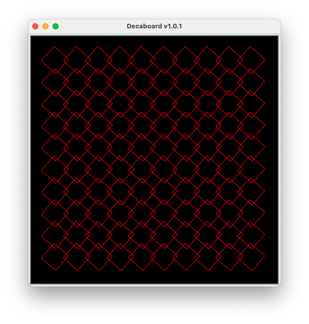

# Extended Abstract: The Decaboard Programming Toy

Decaboard is a programming toy designed to give beginning programmers practice
basic concepts such as literals, variables, expressions, and statements. It can
also be used as an introduction shaders and GPUs to more experienced
programmers, or simply as an easy way to make pretty patterns.

We used this project in two high school grade 12 programming courses. Students
played with it about a quarter of the way through the course. Feedback was quite
positive and all students found it at least some of it fun, and some students
found it especially interesting as a way to get into shaders and graphics.

## What is Decaboard?

Decaboard is based on GPU shaders. In a GPU shader you write a function that
takes in the (x, y) position of a pixel of an image and return a color. This one
function is applied simultaneously to thousands of pixels in the image, and
using modern GPUs this can be done fast enough to do real-time graphical
effects. 

Decaboard is the same idea, except pixels are replaced by squares, and setting
colors is replaced by setting the rotation angle of the square. You write a
single function called `angleIt(row, col, elapsedTime)` that returns the
rotation angle of the square based only on the row, column, and how long the
program has been running for (`elapsedTime`).

For example, this code:

```python
# example.py

import decaboard

def angleIt(row, col, elapsed_seconds):
    return 41

decaboard.run_board(angleIt)
```

Draws this:



## Using it with Students

This can be used in a variety ways:

- With beginning programmers, you could give a short demo of what the program
  can do, then have students work through the problem set, or just play with it
  to see what patterns appear.
- For students who already know a little programming, you could introduce
  shaders and GPUs, and treat this as an introduction to shader-style
  programming. A PowerPoint presentation is provided that gives a brief overview
  of shaders and GPUs. Some students will likely have heard about shaders, or at
  least GPUs, from video games. It also gives some interesting examples of using
  basic mathematical functions in unexpected ways.
- For more advanced students, it could be the basis for project. For instance,
  they could use it to create visualizations of math functions, or they could
  modify [decaboard.py](decaboard.py) to be have more squares, or to replace the
  square with pictures, etc. Another fun idea is to have the function return
  more than just the angle of the square, e.g. it could return a dictionary that
  contains the angle of the square, it's color, it's size, and it's position.
  This can generate a wide variety of interesting outputs.

## Feedback from Students

Informally, all students seemed to enjoy the project and were engaged in figuring out how to make simple patterns. Posing a series of problems that built on each other was appealing, and students could see the step by step process of building up to more complex patterns. Some students were excited to learn that this was a real technique used in graphics programs and asked for pointers on where to go from here.

Overall, the charm of so easily making interesting patterns was clearly
appealing, and it so it was a fun and easy way to practice programming and
problem-solving.

## Related Work

- [Design By Numbers](https://en.wikipedia.org/wiki/Design_By_Numbers) is an old
  idea for introducing programming to design-oriented students by providing a
  special language designed to set pixels on a 100-by-100 grid. It was soon
  eclipsed by [Processing](https://processing.org/), a more fully-featured
  library and language.
- [Replicube](https://store.steampowered.com/app/3401490/Replicube/) is a 3D
  toy/game where you write shader-like programs to create interesting 3D shapes.
