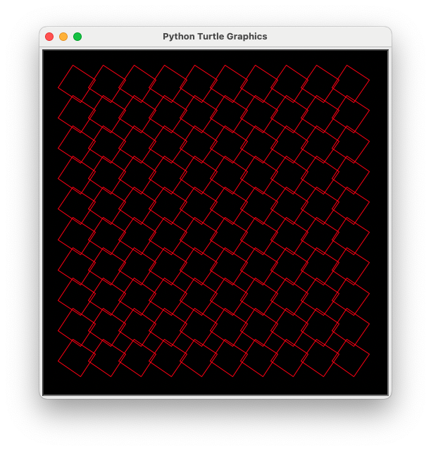
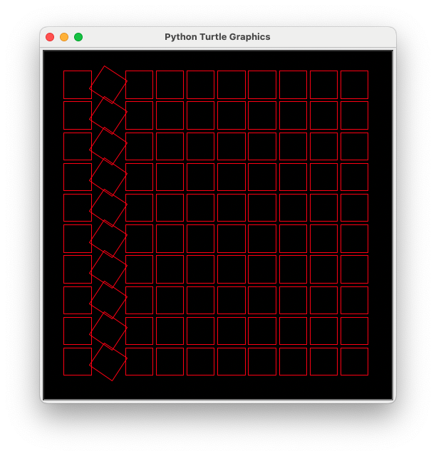
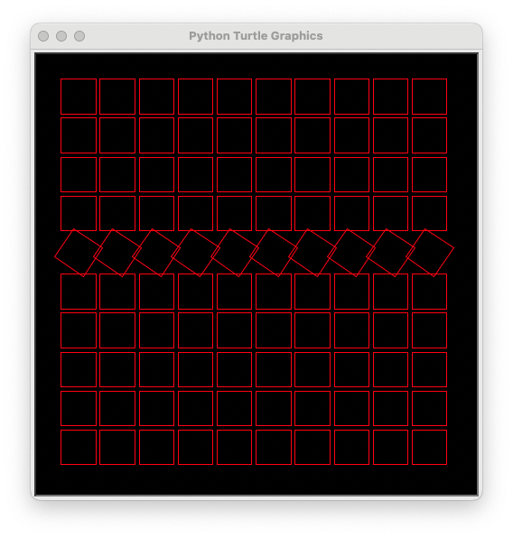
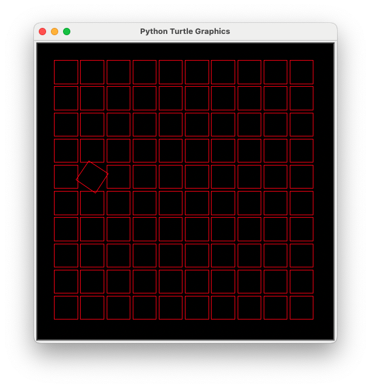
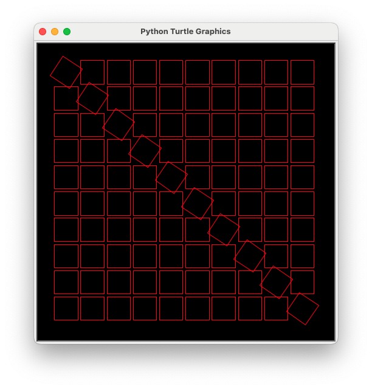
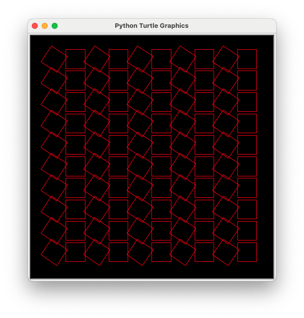
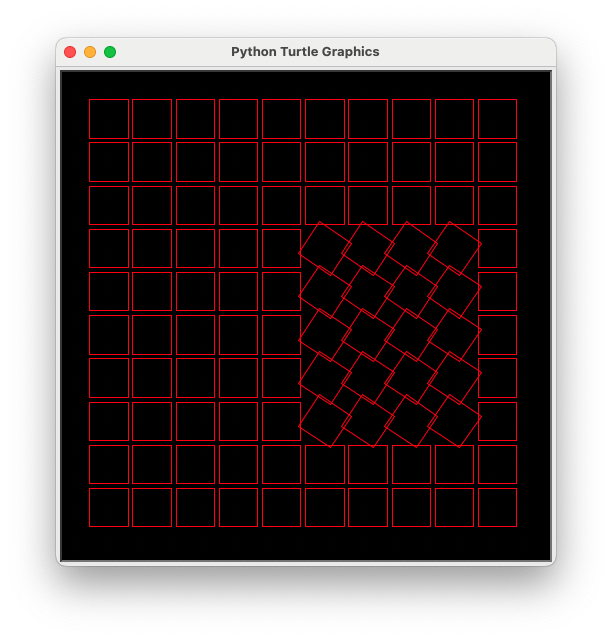
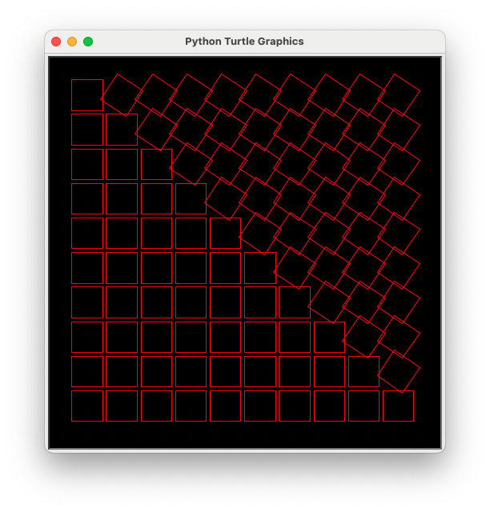
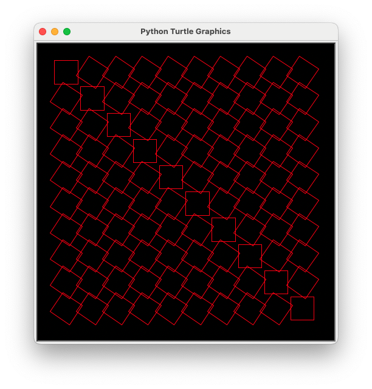
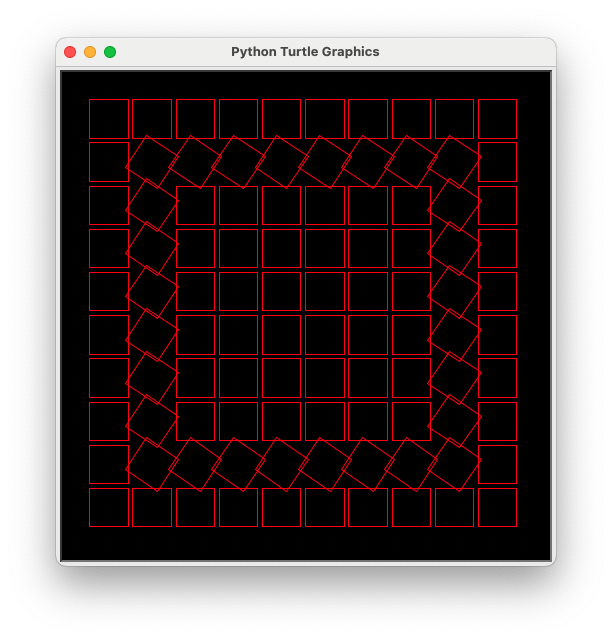

# Problem Set 1

To try these problems, download [decaboard.py](decaboard.py) and
[start.py](start.py) to your computer, and then run `python start.py`.

For each problem, write an `angleIt` function that draws the picture. The number
returned by `angleIt` is the angle (in degrees) that the square will be rotated
around its center.

For instance, to draw this:


You would write this (see [start.py](start.py)):

```python
# start.py

import decaboard

def angleIt(row, col, elapsed_seconds):
    return 0

decaboard.run_board(angleIt)
```

You can control where the window opens by passing in the location of where to
put the window, e.g. `decaboard.run_board(angleIt, 1400, 200)` opens the window
at (1400, 200) near the right top side of the screen.

You can answer each question with its own `.py` file. Or, you can put all your
answers into [start.py](start.py), naming them `angleIt1`, `angleIt2`, etc. Then
pass the function you want to use to `decaboard.run_board`.

## Problem 1

What code draws this?



[Sample solution](prob1_sol.py)

## Problem 2

What code draws this?



[Sample solution](prob2_sol.py)

## Problem 3

What code draws this?



[Sample solution](prob3_sol.py)

## Problem 4

What code draws this?



[Sample solution](prob4_sol.py)

## Problem 5

What code draws this?



[Sample solution](prob5_sol.py)

## Problem 6

What code draws this?



[Sample solution](prob6_sol.py)

## Problem 7

What code draws this?



[Sample solution](prob7_sol.py)

## Problem 8

What code draws this?



[Sample solution](prob8_sol.py)

## Problem 9

What code draws this?



[Sample solution](prob9_sol.py) 

## Problem 10

What code draws this?



[Sample solution](prob10_sol.py)
