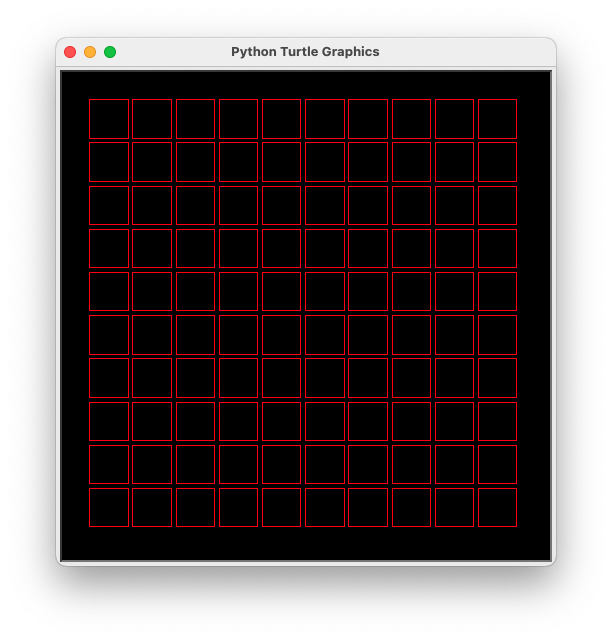

# Problem Set 3

To try these problems, download [decaboard.py](decaboard.py) and
[start.py](start.py) to your computer, and then run `python start.py`.

For each problem, write an `angleIt` function that draws the picture. The number
returned by `angleIt` is the angle (in degrees) that the square will be rotated
around its center.

For instance, to draw this:



You would write this (see [start.py](start.py)):

```python
# start.py

import decaboard

def angleIt(row, col, elapsed_seconds):
    return 0

decaboard.run_board(angleIt)
```

You can control where the window opens by passing in the location of where to
put the window, e.g. `decaboard.run_board(angleIt, 1400, 200)` opens the window
at (1400, 200) near the right top side of the screen.

You can answer each question with its own `.py` file. Or, you can put all your
answers into [start.py](start.py), naming them `angleIt1`, `angleIt2`, etc. Then
pass the function you want to use to `decaboard.run_board`.

## Problem 1

The function `abs(x)` returns the absolute value of `x`. The absolute value of a
number `x` is defined to be `x` if `x` is positive or zero, and `-x` if `x` is
negative. For example, `abs(-3)` is 3, `abs(5)` is 5, and `abs(0)` is 0.

`abs` is a built-in function in Python, but if it wasn't then it could be
implemented like this:

```python
def abs(x):
    if x < 0:
        return -x
    else:
        return x
```

What does this code draw?

```python
def angleIt(row, col, elapsed_seconds):
    return 10 * abs(row - col)
```

[Sample solution](prob1.py)

## Problem 2

The function `math.sin(x)` returns the sine of `x`. The input `x` is an angle
(in radians) and can be *any* number. The output is *always* a number from -1 to
1. 

One way to think about `sin(x)` is that it *squishes* the number `x` into the
range from -1 to 1. The returned values move smoothly up and down from -1 to 1
as `x` changes. If you graph `sin(x)` then you see that it is a horizontal wave.

If you want to squish `x` into, say, the range -10 to 10 then you can use `10 *
math.sin(x)`, i.e. multiply the output of `math.sin(x)` by 10.

To use `math.sin` import the `math` module:

```python
import math

print(math.sin(10))
```

What does this code draw?

```python
import math

def angleIt(row, col, elapsed_seconds):
    return 45 * math.sin(elapsed_seconds)
```

[Sample solution](prob2.py)

## Problem 3

What does this code draw?

```python
import math

def angleIt(row, col, elapsed_seconds):
    return 45 * abs(math.sin(elapsed_seconds))
```

[Sample solution](prob3.py)

## Problem 4

The function `step(edge, x)` returns 0 if `x` is less than `edge`, and 1 if `x`
is greater than, or equal to, `edge`:

```python
def step(edge, x):
    if x < edge:
        return 0
    else:
        return 1
```

This function is simple but some interesting uses. It is like an on/off switch:
if `x` is less than `edge` then it's "off" (the function returns 0), otherwise
it's "on" (the function returns 1).

What does this code draw?

```python
import math

def step(edge, x):
    """
    Returns 0 if x is less than edge, and 1 if x is greater than, 
    or equal to, edge.
    """
    if x < edge:
        return 0
    else:
        return 1

def angleIt(row, col, elapsed_seconds):
    return 45 * step(col, row)
```

[Sample solution](prob4.py)

## Problem 5

What does this code draw?

```python
import math

def step(edge, x):
    if x < edge:
        return 0
    else:
        return 1

def angleIt(row, col, elapsed_seconds):
    if step(3, row) == 1 and step(5, col) == 1:
        return 45 * math.sin(elapsed_seconds)
```

[Sample solution](prob5.py)

## Problem 6

The function `in_range(low, high, x)` returns 1 if `x` is between `low` and
`high` (inclusive), and 0 otherwise:

```python
def in_range(low, high, x):
    if low <= x <= high:
        return 1
    else:
        return 0
```

Similar to the `step` function, it returns the "on" value if `x` is between
`low` and `high` (inclusive), and the "off" value otherwise. 

What does this code draw?

```python
import math

def in_range(low, high, x):
    """
    Returns 1 if low <= x <= high, and 0 otherwise.
    """
    if low <= x <= high:
        return 1
    else:
        return 0

def angleIt(row, col, elapsed_seconds):
    if in_range(1, 6, row) and in_range(1, 3, col):
        return 45 * math.sin(elapsed_seconds)
```

[Sample solution](prob6.py)

## Problem 7

The `clamp(low, high, x)` function returns `low` if `x` is less than `low`,
`high` if `x` is greater than `high`, and `x` otherwise:

```python
def clamp(low, high, x):
    if x < low:
        return low
    elif x > high:
        return high
    else:
        return x
```

The idea is that `clamp(low, high, x)` limits `x` to the range `[low, high]`.
Any value that is too low is replaced with `low` and any value that is too high
is replaced with `high`.

What does this code draw?

```python
def clamp(low, high, x):
    if x < low:
        return low
    elif x > high:
        return high
    else:
        return x

def angleIt(row, col, elapsed_seconds):
    return 20 * clamp(3, 5, row * col)
```

[Sample solution](prob7.py)

## Problem 8

The `step(edge, x)` function from a above jumps suddenly from 0 to 1 at the
`edge`. If you want smoother transition from 0 to 1, you can use the
`smoothstep(edge, x)` function (`clamp` is as in the previous problem):

```python
def smoothstep(low, high, x):
    # scale x to the range [0, 1]
    x = clamp(0, 1, (x - low) / (high - low))
    return x * x * (3.0 - 2.0 * x)
```

The transition form `low` (off) to `high` (on) is now smooth, with no sudden
jump.

The particular expression `x * x * (3 - 2 * x)` is a cubic function that is
commonly used to transition smoothly from 0 to 1 as `x` goes from 0 to 1.

What does this code draw?

```python
import math

def clamp(low, high, x):
    if x < low:
        return low
    elif x > high:
        return high
    else:
        return x

def smoothstep(low, high, x):
    # scale x to the range [0, 1]
    x = clamp(0, 1, (x - low) / (high - low))
    return x * x * (3.0 - 2.0 * x)

def angleIt(row, col, elapsed_seconds):
    return 20 * smoothstep(2, 5, row)
```

[Sample solution](prob8.py)

## Problem 9

The `lerp(x, y, t)` function returns a *linear interpolation* between the
numbers `x` and `y` at time `t` (which must be a number between 0 and 1):

```python
def lerp(x, y, t):
    return (1 - t) * x + t * y
```

This returns a "mix" of `x` and `y` that is proportional to `t`. If `t` is 0
then it returns `x` and if `t` is 1 then it returns `y`. It is like a weighted
average of `x` and `y`.

It can help to think of `t` as a percentage, e.g. if `t` is 0.5 then the result
is 50% -- halfway --- between `x` and `y`. If `t` is 0.25 then the result is 25%
of the way from `x` to `y`.

What does this code draw?

```python
import math

def lerp(x, y, t):
    return (1 - t) * x + t * y

def angleIt(row, col, elapsed_seconds):
    return 20 * lerp(row, col, abs(math.sin(elapsed_seconds)))
```

[Sample solution](prob9.py)
