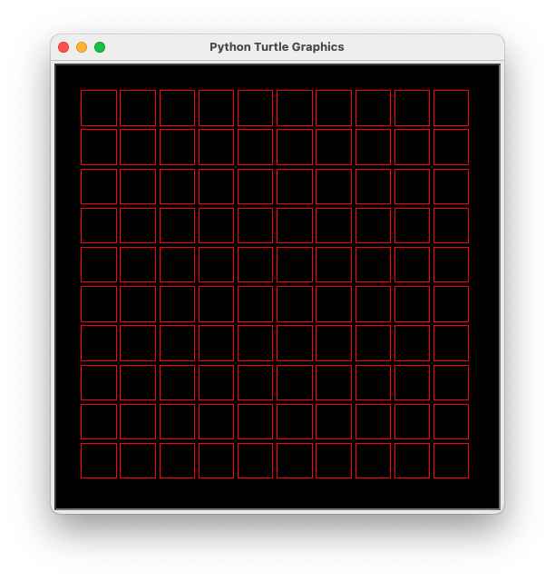

# Problem Set 1

For each of the following problems, write an `angleIt` function that draws the
picture. For instance, to draw this:



You would write this (see [start.py](start.py)):

```python
# start.py

import decaboard

def angleIt(row, col, elapsed_seconds):
    return 34

decaboard.run_board(angleIt)
```

You can controll where the window opens by passing in the location of where to
put the window, e.g. `decaboard.run_board(angleIt, 1400, 200)` opens the window
in the right side of the screen, near the top.

## Problem 1


[Sample solution](prob1_sol.py)

## Problem 2


[Sample solution](prob2_sol.py)

## Problem 3


[Sample solution](prob3_sol.py)

## Problem 4


[Sample solution](prob4_sol.py)

## Problem 5


[Sample solution](prob5_sol.py)

## Problem 6


[Sample solution](prob6_sol.py)

## Problem 7


[Sample solution](prob7_sol.py)

## Problem 8


[Sample solution](prob8_sol.py)

## Problem 9


[Sample solution](prob9_sol.py) 

## Problem 10


[Sample solution](prob10_sol.py)
